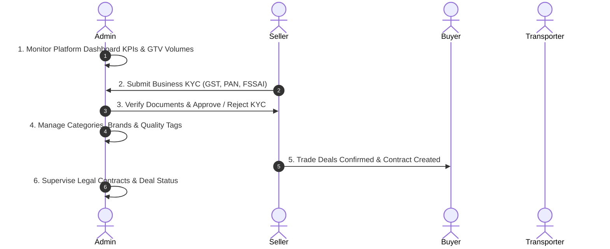

# 👨‍💼 DaalSetu Admin Panel — Complete Developer Specification

**Role:** Super Admin / Platform Administrator  
**Web Portal URL:** [https://daalsetu.zappcode.in/dashboard/](https://daalsetu.zappcode.in/dashboard/)  
**API Base URL:** `https://daalsetu.zappcode.in`  
**Test Login:** Mobile: `7245635763` | Password: `12345`

---

## 📌 1. Admin Role Overview & Lifecycle

The **Admin** governs the entire DaalSetu platform. The admin is responsible for approving new user registrations & KYC submissions, configuring commodity categories/subcategories, inspecting platform-wide GTV metrics & contracts, and supervising deals between Sellers, Buyers, and Transporters.



---

## 📱 2. Admin Screens & File Structure

All Admin screens, controllers, and services in the mobile app:

```
lib/modules/
├── dashboard/               # Platform KPI metrics, charts (GTV MTD, Commodity mix, Pipeline stages)
├── users/                   # Global User Directory (Search, Filter by Role, Add User)
├── kyc_users/               # KYC User Approval / Rejection workflow with document viewer
├── category/                # Commodity Hierarchy (Categories & Sub-categories CRUD)
├── contracts/               # Platform Contracts (Contract details, status updates, delete)
├── products/                # Catalog view of all published commodity listings
├── admin_catalog/           # Admin Offer creation, stock updates & history
└── settings/                # Profile, password management, and app preferences
```

---

## 🔗 3. Screen-by-Screen API Specification

| Screen / Feature | Mobile File Path | HTTP Method & Endpoint | Status | Purpose & Functional Requirement |
| :--- | :--- | :--- | :--- | :--- |
| **Admin Dashboard** | `lib/modules/dashboard/view/dashboard_page.dart` | `GET /api/admin/dashboard/` | ✅ **Real API** | Retrieves macro KPIs: Active contracts count, Gross Transaction Value (MTD), pipeline breakdown, and commodity share. |
| **User Directory** | `lib/modules/users/view/users_page.dart` | `GET /api/users/` | ✅ **Real API** | Lists all registered accounts across all 4 roles with search, status filters (`Active`/`Inactive`), and phone numbers. |
| **Add New User** | `lib/modules/users/view/add_user_page.dart` | `POST /api/adduser/` | ✅ **Real API** | Admin can manually onboard users by specifying name, mobile, role, and initial password. |
| **KYC User Listing** | `lib/modules/kyc_users/view/kyc_user_view.dart` | `GET /api/kyc/list/` | ✅ **Real API** | Lists pending, approved, and rejected KYC records with company names, GST numbers, and document previews. |
| **Approve / Reject KYC**| `lib/modules/kyc_users/` | `POST /api/kyc/request-approval/` | ✅ **Real API** | Admin approves KYC to grant trading permission or rejects it with an explanation remark. |
| **Category Master** | `lib/modules/category/view/category_page.dart` | `GET /api/categories/`<br>`POST /api/categories/` | ✅ **Real API** | Manage commodity categories (e.g. Pulses, Grains) with category image upload. |
| **Sub-Category Master** | `lib/modules/category/view/category_page.dart` | `GET /api/categories/{id}/sub-category/`<br>`POST /api/categories/{parentId}/sub-category/` | ✅ **Real API** | Manage subcategories linked to parent commodity (e.g. Toor Dal -> Desi, Fatka, Poland). |
| **Contracts Management**| `lib/modules/contracts/view/contract_view.dart` | `GET /api/mobile/contracts/`<br>`PUT /api/mobile/contracts/{id}/` | ✅ **Real API** | View all executed trade contracts, download deal summaries, and update contract execution status. |
| **Products & Offers** | `lib/modules/products/view/product_view.dart` | `GET /api/products/` | ✅ **Real API** | View all live commodity listings posted across the platform. |
| **Stock History Dialog**| `lib/modules/admin_catalog/view/stock_history_dialog.dart` | `mockHistory` list | ⚠️ **DUMMY DATA** | **Fix Required:** Connect dialog to `GET /api/offers/{productId}/stock-history/` instead of static memory array. |
| **Sub-Admins & RBAC** | *Not in mobile nav* | `GET /rbac/sub-admins/`<br>`GET /rbac/roles/` | ❌ **Web Only** | Role-based access control and sub-admin staff creation available on the web portal. |

---

## 📋 4. Developer Action Items for Admin Role

- [x] **Admin Authentication & Token Handling:** Tested & working (`7245635763` / `12345`).
- [x] **Dashboard KPIs & Charts:** Fully connected to `/api/admin/dashboard/`.
- [x] **User Management & KYC Approvals:** Fully operational with live APIs.
- [ ] **Fix Stock History Dialog:** In `lib/modules/admin_catalog/view/stock_history_dialog.dart`, hook the dialog to `ApiUrls.offerStockHistory(productId)` to display live inventory changes.
