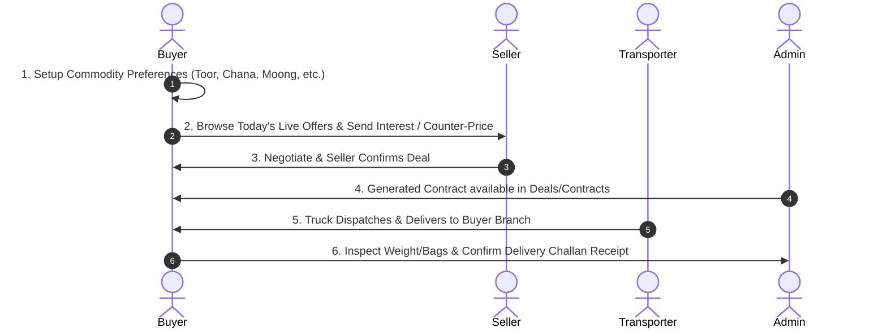

# 🛒 DaalSetu Buyer Panel — Complete Developer Specification

**Role:** Buyer (Wholesaler / Retailer / Institution)  
**Web Portal URL:** [https://daalsetu.zappcode.in/dashboard/buyer/](https://daalsetu.zappcode.in/dashboard/buyer/)  
**API Base URL:** `https://daalsetu.zappcode.in`  
**Test Login:** Mobile: `7410852963` | Password: `wtV5it%8`

---

## 📌 1. Buyer Role Overview & Lifecycle

A **Buyer** in DaalSetu is an agricultural commodity trader, wholesaler, supermarket chain, or retailer who purchases pulses/grains in bulk, negotiates competitive rates directly with dal millers, posts custom buy requirements, and verifies incoming delivery challans upon truck arrival.



---

## 📱 2. Buyer Screens & File Structure

All Buyer screens and controllers are located in [`lib/modules/buyer/`](file:///d:/Flutter_project/DaalSetu/lib/modules/buyer):

```
lib/modules/buyer/
├── dashboard/               # Buyer Dashboard (Category shortcuts, deal stats, KYC status)
├── offers/                  # Today Offers, Pending Offers, Previous Offers, My Interests, Post RFQ
├── delivery_challan/        # Incoming Challans, Weighment Verification, Confirm Received
├── branch/                  # Delivery Destination Hubs / Warehouse Branches
├── orders/                  # Confirmed Deals & Order Tracking
└── transport/               # Transport Route & Shipment Milestone Stepper
```

---

## 🔗 3. Screen-by-Screen API Specification

| Screen / Feature | Mobile File Path | HTTP Method & Endpoint | Status | Purpose & Functional Requirement |
| :--- | :--- | :--- | :--- | :--- |
| **Buyer Dashboard** | `lib/modules/buyer/dashboard/view/buyer_dashboard_view.dart` | `GET /api/buyer/dashboard/` | ✅ **Real API** | Fetches buyer overview metrics: Active trade interests count, confirmed contracts, recent marketplace activity. |
| **Category Preferences** | `lib/modules/buyer/dashboard/` | `GET /api/buyer-categories/` | ✅ **Real API** | Retrieves buyer-selected commodity categories to filter their home feed. |
| **Today's Market Offers** | `lib/modules/buyer/offers/view/buyer_offers_view.dart` | `GET /api/offers/today/` | ✅ **Real API** | Live marketplace showing grain listings created today with miller rates, minimum order qty, and origin location. |
| **Pending & Previous Offers**| `lib/modules/buyer/offers/view/buyer_offers_view.dart` | `GET /api/offers/pending/`<br>`GET /api/offers/previous/` | ✅ **Real API** | Historical marketplace view of active pending listings and previously closed offers. |
| **Offer Details & Photos** | `lib/modules/buyer/offers/view/buyer_offer_details_view.dart` | `GET /api/offers/{id}/` | ✅ **Real API** | Shows full commodity specs, moisture level, grain photos/videos, miller brand, and terms. |
| **Show Interest / Counter-Offer**| `lib/modules/buyer/offers/view/buyer_offer_details_view.dart` | `POST /api/offers/{id}/show-interest/` | ✅ **Real API** | Buyer submits a trade bid with desired quantity (e.g. 25 MT) and counter-rate per kg. |
| **My Interests Tracker** | `lib/modules/buyer/offers/view/buyer_my_interests_view.dart` | `GET /api/offers/my-interests/list/` | ✅ **Real API** | Live tracker of buyer's submitted bids: Status shows `Pending`, `Accepted` (Deal Made), or `Rejected`. |
| **Post Requirement (RFQ)** | `lib/modules/buyer/offers/view/buyer_create_requirement_view.dart` | `POST /api/buyer-requirements/`<br>`POST /api/buyer-offers/create/` | ✅ **Real API** | If buyer cannot find stock in market, posts a custom buy requirement for millers to bid on. |
| **Incoming Delivery Challans**| `lib/modules/buyer/delivery_challan/view/buyer_delivery_challan_view.dart` | `GET /api/buyer/delivery-challans/` | ✅ **Real API** | Lists all shipments heading to the buyer's warehouses with truck numbers and driver details. |
| **Verify & Receive Challan** | `lib/modules/buyer/delivery_challan/` | `POST /api/buyer/delivery-challans/{id}/receive/` | ✅ **Real API** | Physical gate verification: Buyer confirms received bag count and net weight, and finalizes the delivery. |
| **Delivery Branch Hubs** | `lib/modules/buyer/branch/view/buyer_branch_view.dart` | `POST /api/seller/branches/request-by-code/` | ✅ **Real API** | Connects buyer to destination warehouses/delivery locations. |
| **Shipment Route Tracking** | `lib/modules/buyer/transport/` | Milestone Stepper | ⚠️ **Simulated GPS** | Displays shipment lifecycle milestones (`Dispatched` -> `In-Transit` -> `Arrived`). Live moving map marker requires GPS feed. |

---

## 📋 4. Developer Action Items for Buyer Role

- [x] **Buyer Authentication & Category Filters:** Tested & working (`7410852963` / `wtV5it%8`).
- [x] **Marketplace Discovery & Bid Submission:** Connected to live `/api/offers/today/` and `/api/offers/{id}/show-interest/`.
- [x] **Delivery Challan Receipt:** Connected to `/api/buyer/delivery-challans/{id}/receive/`.
- [ ] **Live GPS Telemetry (Optional):** If the client wants live moving truck icons on the map, backend needs to supply live coordinates polling or WebSocket feed.
