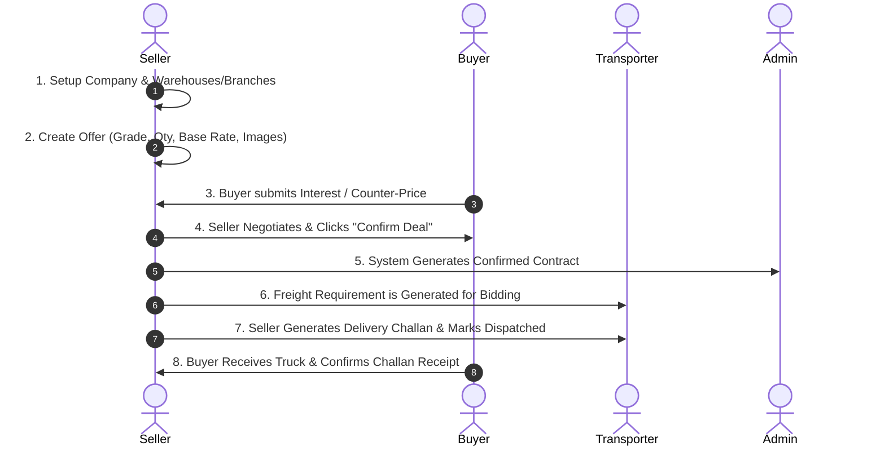

# 🌾 DaalSetu Seller Panel — Complete Developer Specification

**Role:** Seller (Miller / Stockist / Trader)  
**Web Portal URL:** [https://daalsetu.zappcode.in/dashboard/seller/](https://daalsetu.zappcode.in/dashboard/seller/)  
**API Base URL:** `https://daalsetu.zappcode.in`  
**Test Login:** Mobile: `1234567890` | Password: `123456`

---

## 📌 1. Seller Role Overview & Lifecycle

A **Seller** in DaalSetu is an agricultural processor, dal mill owner, or commodity stockist who lists inventory for sale, negotiates with buyers, confirms legal sales contracts, and dispatches goods via transporters.



---

## 📱 2. Seller Screens & File Structure

All Seller screens and controllers are located in [`lib/modules/seller/`](file:///d:/Flutter_project/DaalSetu/lib/modules/seller):

```
lib/modules/seller/
├── dashboard/               # Seller Dashboard (Sales KPIs, revenue charts, quick actions)
├── products/                # Create Offer, My Offers, Stock Update, Deal Confirmation
├── rfq/                     # Buyer Requirements / Inquiries (Seller quotes on RFQs)
├── buyer_offers/            # Direct Buyer Offers & Negotiations
├── challans/                # Delivery Challans generation and dispatch
├── consignments/            # Consignments loading workflow and status
├── company/                 # Registered Seller Company profiles
├── branches/                # Mill / Warehouse Branch management & switching
├── masters/                 # Brand & Packaging Tag Masters
├── categories/              # Seller Category & Subcategory explorer
└── workspace/               # Central Seller Hub menu
```

---

## 🔗 3. Screen-by-Screen API Specification

| Screen / Feature | Mobile File Path | HTTP Method & Endpoint | Status | Purpose & Functional Requirement |
| :--- | :--- | :--- | :--- | :--- |
| **Seller Dashboard** | `lib/modules/seller/dashboard/view/seller_dashboard_view.dart` | `GET /api/seller/dashboard/` | ✅ **Real API** | Fetches seller-specific KPIs: Active offers count, monthly sales revenue, total MT dispatched, and active contracts. |
| **Create New Offer** | `lib/modules/seller/products/view/add_product_view.dart` | `POST /api/offers/create/` | ✅ **Real API** | Seller lists goods for sale with commodity ID, grade, price per kg, minimum order quantity, packaging bags, and origin branch. |
| **My Offers List** | `lib/modules/seller/products/view/seller_product_view.dart` | `GET /api/products/` | ✅ **Real API** | Lists all offers published by this seller with live stock, active toggle status, and received buyer bids count. |
| **Edit / Update Offer** | `lib/modules/seller/products/view/add_product_view.dart` | `PUT /api/offers/{id}/update/` | ✅ **Real API** | Updates listing details (pricing, minimum quantity, specifications). |
| **Delete / Deactivate Offer**| `lib/modules/seller/products/` | `DELETE /api/offers/{id}/delete/`<br>`POST /api/offers/{id}/toggle/` | ✅ **Real API** | Soft delete or toggle listing between Active / Inactive. |
| **Buyer Interests & Negotiation**| `lib/modules/seller/products/` | `GET /api/offers/{id}/interests/`<br>`POST /api/offers/{id}/interests/{interestId}/message/` | ✅ **Real API** | Shows all incoming buyer bids for an offer. Allows chat/negotiation and counter-offers. |
| **Confirm Deal with Buyer** | `lib/modules/seller/products/` | `POST /api/offers/{id}/confirm-deal/` | ✅ **Real API** | Seller accepts buyer's price and quantity. Automatically generates a confirmed **Contract** and locks stock. |
| **Buyer Requirements (RFQs)** | `lib/modules/seller/rfq/view/seller_rfq_list_view.dart` | `GET /api/rfqs/`<br>`POST /api/rfqs/{id}/quote/` | ✅ **Real API** | Reverse marketplace: View inquiries posted by buyers and submit competitive seller price quotes. |
| **Consignments Management** | `lib/modules/seller/consignments/view/seller_consignments_view.dart` | `GET /api/consignments/`<br>`POST /api/consignments/{id}/` | ✅ **Real API** | Track truck loading at mill, record driver details, and generate loading slips. |
| **Delivery Challan & Dispatch**| `lib/modules/seller/challans/view/seller_delivery_challan_view.dart` | `GET /api/seller/delivery-challans/`<br>`POST /api/seller/delivery-challans/{id}/dispatch/` | ✅ **Real API** | Generates official delivery challan with bag count & gross weight and marks the order as **Dispatched**. |
| **Registered Company** | `lib/modules/seller/company/view/seller_company_view.dart` | `GET /api/company/`<br>`POST /api/company/`<br>`POST /api/company/{id}/set-primary/` | ✅ **Real API** | View and manage registered miller company profiles (GST, PAN, Address). |
| **My Branches / Warehouses** | `lib/modules/seller/branches/view/seller_branches_view.dart` | `GET /api/seller/branches/`<br>`POST /api/seller/branches/request-by-code/` | ✅ **Real API** | Manage multiple branch locations and switch active operating branch. |
| **Brand & Tag Masters** | `lib/modules/seller/masters/view/seller_master_management_view.dart` | `GET /api/brands/`<br>`GET /api/tags/dropdown/` | ✅ **Real API** | Manage packaging brand names and grain quality tags (e.g. "Sortex Cleaned"). |
| **Media Gallery** | `lib/modules/seller/products/` | `POST /api/product-images/`<br>`POST /api/product-videos/`<br>`POST /api/offer-images/create/` | ✅ **Real API** | Upload sample grain images and video proofs for buyer inspection. |

---

## 📋 4. Developer Action Items for Seller Role

- [x] **Seller Authentication & Branch Persistence:** Tested & working (`1234567890` / `123456`).
- [x] **Offers CRUD & Negotiation Flow:** Fully connected to live backend APIs.
- [x] **Delivery Challan & Dispatch Trigger:** Fully integrated with `/api/seller/delivery-challans/`.
- [ ] **Push Notifications:** Setup FCM notification listener for real-time alerts when a buyer submits a new counter-bid.
