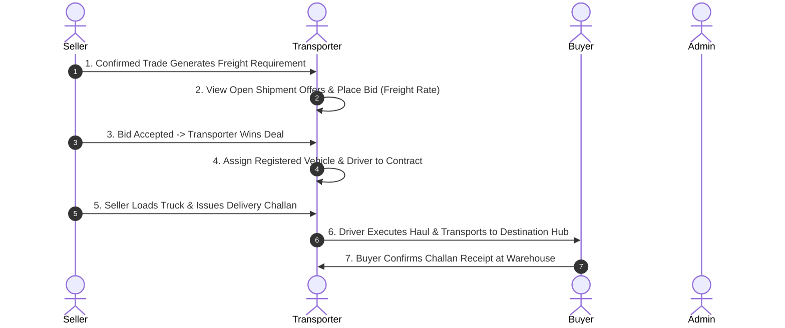

# 🚛 DaalSetu Transporter Panel — Complete Developer Specification

**Role:** Transporter (Logistics Provider / Fleet Owner)  
**Web Portal URL:** [https://daalsetu.zappcode.in/dashboard/transporter/](https://daalsetu.zappcode.in/dashboard/transporter/)  
**API Base URL:** `https://daalsetu.zappcode.in`  
**Test Login:** Mobile: `7999840592` | Password: `gt@5life`

---

## 📌 1. Transporter Role Overview & Lifecycle

A **Transporter** in DaalSetu is a logistics company or fleet operator that bids on shipment contracts for confirmed commodity trades, assigns dedicated trucks and drivers, and manages haulage execution from seller mills to buyer warehouses.



---

## 📱 2. Transporter Screens & File Structure

All Transporter screens and controllers are located in [`lib/modules/transporter/`](file:///d:/Flutter_project/DaalSetu/lib/modules/transporter):

```
lib/modules/transporter/
├── dashboard/               # Transporter Dashboard (Earnings Lakhs, trip volume, routes, KPI charts)
├── bidding/                 # Open Shipment Offers, Place Freight Bid, My Won Deals
├── drivers/                 # Registered Drivers (Add Driver, License, Assign Vehicle)
├── vehicles/                # Fleet Vehicles (Add Truck, RC, Capacity Tonnage)
├── branch/                  # Origin/Destination Hub Branch membership requests
├── contracts/               # Won Haulage Contracts & Trip Details
└── company/                 # Registered Transporter Company & KYC details
```

---

## 🔗 3. Screen-by-Screen API Specification

| Screen / Feature | Mobile File Path | HTTP Method & Endpoint | Status | Purpose & Functional Requirement |
| :--- | :--- | :--- | :--- | :--- |
| **Transporter Dashboard** | `lib/modules/transporter/dashboard/view/transporter_dashboard_view.dart` | `GET /api/transporter/dashboard/overview/` | ✅ **Real API** | Fetches earnings metrics (Lakhs), trip count, delivery status breakdowns, transport types, and top transit corridors. |
| **Driver Management** | `lib/modules/transporter/drivers/view/transporter_drivers_view.dart` | `GET /api/drivers/`<br>`POST /api/drivers/` | ✅ **Real API** | Registers drivers with driver name, contact number, driving license number, and photo. |
| **Assign Vehicle to Driver**| `lib/modules/transporter/drivers/` | `POST /api/drivers/{id}/assign-vehicle/` | ✅ **Real API** | Links a specific truck to a driver for simplified trip allocation. |
| **Vehicle Fleet Management**| `lib/modules/transporter/vehicles/view/transporter_vehicles_view.dart` | `GET /api/vehicles/`<br>`POST /api/vehicles/` | ✅ **Real API** | Registers fleet trucks with vehicle number, vehicle type (Open/Container), tonnage capacity (e.g. 25 MT), and RC document. |
| **Open Shipment Offers** | `lib/modules/transporter/bidding/view/transporter_bidding_view.dart` | `GET /api/transport-bids/?view=open` | ✅ **Real API** | Live freight exchange: Browse confirmed commodity contracts requiring transportation with origin mill, destination city, and weight. |
| **Submit Freight Bid** | `lib/modules/transporter/bidding/` | `POST /api/transport-bids/` | ✅ **Real API** | Transporter submits freight bid amount (e.g. ₹2,500/MT) for the shipment contract. |
| **My Deals & Won Contracts**| `lib/modules/transporter/bidding/` | `GET /api/transport-bids/?view=mine` | ✅ **Real API** | Lists won transportation deals, pending trips, and active consignments. |
| **Assign Fleet to Deal** | `lib/modules/transporter/bidding/` | `POST /api/transport-bids/{id}/` (`action: assign_driver`) | ✅ **Real API** | Transporter assigns the vehicle and driver allocated to haul the confirmed shipment. |
| **Hub Branch Requests** | `lib/modules/transporter/branch/` | `POST /api/seller/branches/request-by-code/` | ✅ **Real API** | Requests access/membership to regional pickup and delivery warehouse branch codes. |
| **Live Vehicle Map Tracking**| `lib/modules/transporter/dashboard/` | Milestone Stepper | ⚠️ **Simulated GPS** | Displays shipment lifecycle milestones (`Assigned` -> `Dispatched` -> `Delivered`). Real-time moving truck requires GPS telemetry feed. |

---

## 📋 4. Developer Action Items for Transporter Role

- [x] **Transporter Authentication & Profile:** Tested & working (`7999840592` / `gt@5life`).
- [x] **Dashboard Overview KPIs:** Fully connected to `/api/transporter/dashboard/overview/`.
- [x] **Drivers & Vehicles CRUD:** Fully functional with live `/api/drivers/` and `/api/vehicles/`.
- [x] **Live Freight Bidding & Driver Allocation:** Fully operational with live `/api/transport-bids/`.
- [ ] **Live GPS Coordinates (Optional):** If live Google Maps truck tracking is required, backend should provide vehicle GPS streaming endpoint.
